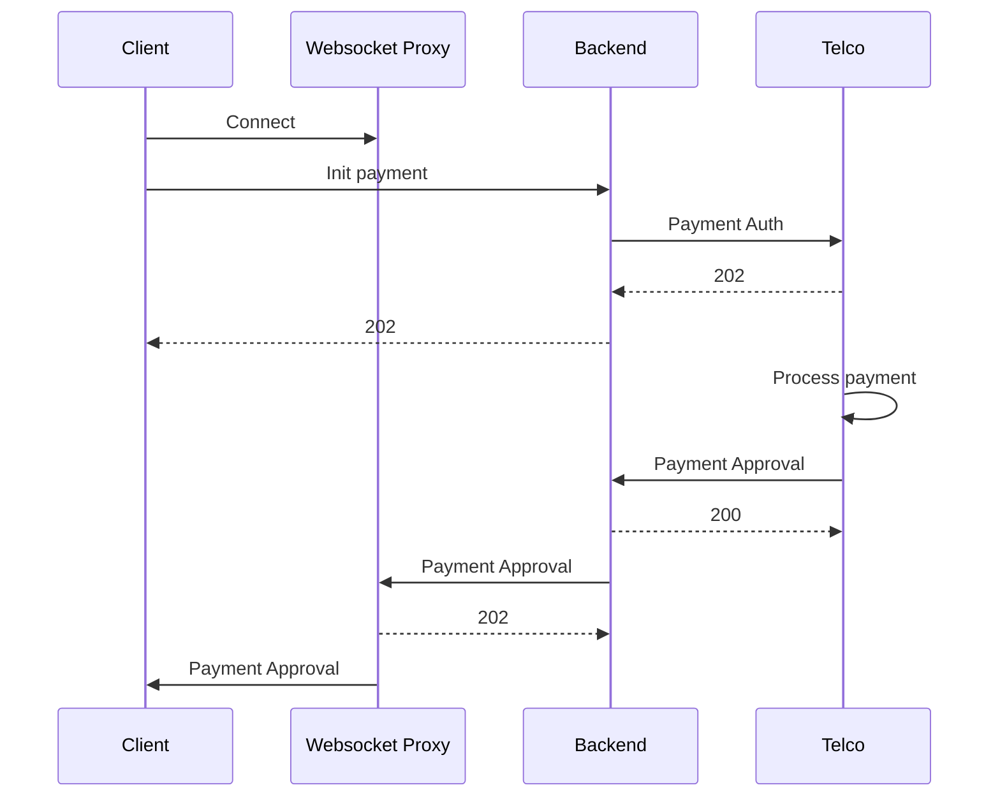
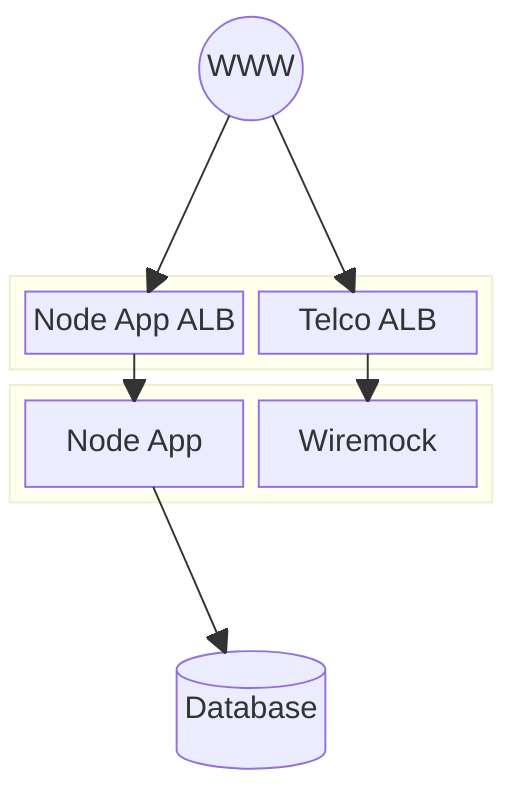

# Yellow Candidate Project

## Business Logic

- Customer registers with their personal details.
- Backend approves/denies based on age
- If approved:
    - Customer purchases device and submits details and amount and IMEI
    - Customer can later pay back the full amount via Telco integration
    - Customer cannot purchase more devices
- Else if denied:
    - Disallow purchase, and paying back.
    - Customer is allowed to attempt registration again.

## Payment flow

To prevent continuous polling, the backend uses a websocket proxy (ExpressJS server) to communicate payment status
updates to the client instantly and asynchronously.



## Infrastructure architecture



## Development

```sh
# Install pnpm (10x better than npm)
sudo npm install -g pnpm

cp .env.example .env.local
tests/docker/start_testcontainers.sh
pnpm install
# Run main Svelte App
pnpm run dev
```

Updating the DB schema:

```sh
pnpm run drizzle-generate
# Migration happens at runtime
```

### Run playwright tests locally

```sh
npx playwright test --ui
```

## Future scope

- cookie security: domain, JWT signing
- Custom db indexes, to speed up lookups.
- DB partitioning for cleaning
- Assuming currency=ZAR
- Login/session system (eg auth on payment init)
- Security on /webhook/payment-status endpoint
- Handle websocket client termination (payment approved after client disconnects)
- Handle malformed messages in websocket
- Handle multiple payment attempts. Currently, if a user starts a new payment previous attempts are discarded.
- Handle telco payment auth rejection
